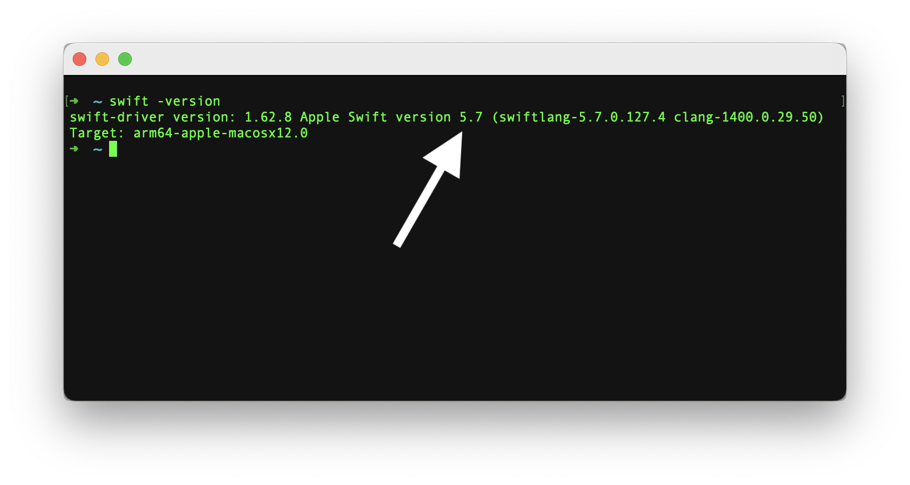

Swift v5.7 | [Swift versions](find-my-swift-version.md) | [Swift.org](https://docs.swift.org).

Created by Matthew Harding
@[MatthewpHarding](https://github.com/MatthewpHarding) 🔗

🤩 *..let's live a better life, by learning Swift* 🛠

```Swift
let myLife = [learning, coding, happiness] 
```
### 🧕🏻👨🏿‍💼👩🏼‍💼👩🏻‍💻👨🏼‍💼🧛🏻‍♀️👩🏼‍💻💁🏽‍♂️🕵🏻‍♂️🧝🏼‍♀️🦹🏼‍♀🧕🏾🧟‍♂️
-----------

# 🔎 Find My Version of Swift

Finding your current version of Swift is easy. Just follow the steps below:

**Step 1**: Open the Terminal app on your macbook. 
💡 **Tip**: Press `cmd + space` and type `Terminal.app` in the search bar that appears.

**Step 2**: Type `swift -version` into the Terminal window.

**Step 3**: Read the version printed.  

In the example below, **Apple Swift version 5.7** was printed. 👍



## Our Services
We made the official Swift documentation searchable. [Try it](https://github.com/MatthewpHarding?tab=repositories&q=SWIFTDOCS+hello+world). Our aim is to optimise career growth for juniors learning iOS by teaching Swift via our online courses. We have taken the official Swift documentation and **simplified it** for fast learning. 😎

💡 **Top Tip**: During an iOS interview they'll ask questions about Swift, not iOS! To BOOST 🚀 your career forwards become an expert of the Swift language.

- 🔍 **Searchable Swift documentation**: [Try it](https://github.com/MatthewpHarding?tab=repositories&q=SWIFTDOCS+hello+world).

- 🕊 **Xcode playgrounds**: Run and execute the official Swift documentation in Xcode! . [Try it](https://github.com/MatthewpHarding/SWIFTDOCS-1-the-basics/archive/refs/heads/main.zip).

- 👉 **Online Courses**: [**Swift Simplified** *(for fast learning)* A Guided Tour of Swift](https://www.udemy.com/user/iosbfree) can be found on [Udemy.com](https://www.udemy.com/user/iosbfree). [Try it](https://www.udemy.com/user/iosbfree).

- *Preview* our Online Course Xcode playground [**Swift Simplified**: A Guided Tour of Swift](https://github.com/MatthewpHarding/a-tour-of-swift) 

# 🧑🏼‍💻
Created by Matthew Harding
@[MatthewpHarding](https://github.com/MatthewpHarding) 🔗

🤩 *..let's live a better life, by learning Swift* 🛠

```Swift
let myLife = [learning, coding, happiness] 
```
### 🧕🏻👨🏿‍💼👩🏼‍💼👩🏻‍💻👨🏼‍💼🧛🏻‍♀️👩🏼‍💻💁🏽‍♂️🕵🏻‍♂️🧝🏼‍♀️🦹🏼‍♀🧕🏾🧟‍♂️